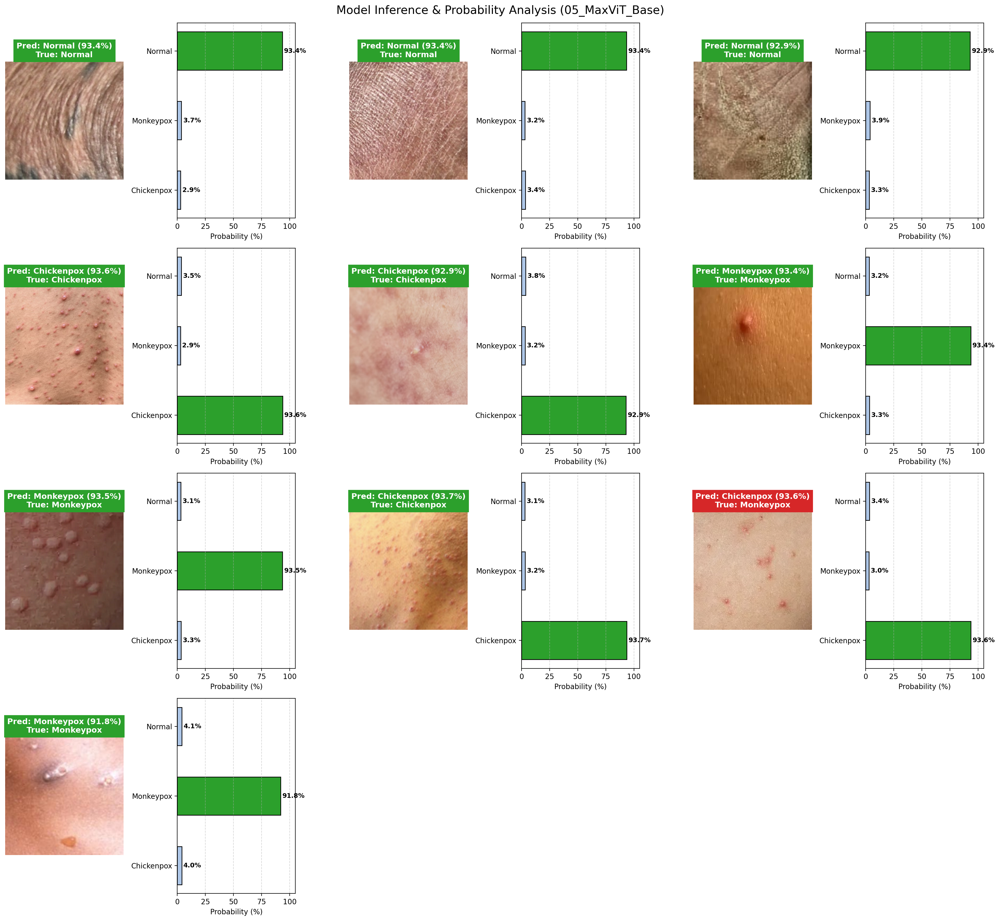

# Comparative Empirical Evaluation of Modern Vision Transformer and Hybrid Architectures for Multiclass Monkeypox Skin Lesion Classification with Test-Time Augmentation and Interpretability Auditing

[](https://www.python.org/downloads/)
[](https://pytorch.org/)
[](https://github.com/huggingface/pytorch-image-models)
[](https://opensource.org/licenses/MIT)

Official implementation and evaluation suite for the research paper:

> **"Comparative Empirical Evaluation of Modern Vision Transformer and Hybrid Architectures for Multiclass Monkeypox Skin Lesion Classification with Test-Time Augmentation and Interpretability Auditing"**  
> **Authors:** Neamul Morshed Neon¹, Md. Nur-A-Alam¹*, Nayeem Ahmed Emon¹, Sadia Anjum Puspo², Nurus Salehin Sirat¹  
> ¹ *Department of Computer Science and Engineering, Sunamgonj Science and Technology University, Sunamganj-3000, Bangladesh*  
> ² *Department of Computer Science and Engineering, Shahjalal University of Science and Technology, Sylhet-3100, Bangladesh*  
> \* *Corresponding author:* `nuraalam@sstu.ac.bd`  
> 📄 [Research Paper Draft (PDF)](./Monkeypox_Transformer_Research_Paper_DRAFT1.pdf)

---

## Abstract Summary

The global re-emergence of Monkeypox (Mpox) presents an urgent diagnostic imperative, heavily exacerbated by the striking phenotypic mimicry between Mpox lesions and other vesiculopustular dermatological conditions, particularly Chickenpox (Varicella zoster). While gold-standard PCR assays offer definitive microbiological confirmation, their clinical utility in resource-constrained frontline settings is hindered by cost, infrastructure, and turnaround delays.

This study presents a standardized, controlled comparative evaluation of **twelve deep learning architectures**:
- **8 Pure & Hierarchical Vision Transformers:** ViT-Base, DeiT-Base, Swin-Base, BEiT-Base, MaxViT-Base, PiT-Base, MAE-Base, and FlexiViT-Base.
- **4 Hybrid Convolution-Transformer Models:** CoAtNet-1, CvT-Hybrid, Visformer-Small, and ConViT-Small.

Evaluated on an isolated multiclass cohort of **6,127 clinical images** (4,901 training, 1,226 held-out test), all models were trained under identical optimization protocols, differential learning rates, cosine annealing, and domain-informed regularizations with grayscale conversion to neutralize skin tone pigmentation and illumination bias.

---

## Evaluated Architectures

| Architecture | Variant / `timm` Tag | Family | Parameters | Primary Reference |
| :--- | :--- | :--- | :---: | :--- |
| **ViT** | `vit_base_patch16_224` | Pure ViT | 85.80M | Dosovitskiy et al., ICLR 2021 |
| **DeiT** | `deit_base_patch16_224` | Distilled ViT | 85.80M | Touvron et al., ICML 2021 |
| **Swin** | `swin_base_patch4_window7_224` | Hierarchical ViT | 86.75M | Liu et al., ICCV 2021 |
| **BEiT** | `beit_base_patch16_224` | Masked Pre-trained | 85.76M | Bao et al., ICLR 2022 |
| **MaxViT** | `maxvit_base_tf_224` | Multi-Axis Attention | 118.70M | Tu et al., ECCV 2022 |
| **PiT** | `pit_b_224` | Spatial Pooling ViT | 72.74M | Heo et al., NeurIPS 2021 |
| **MAE** | `vit_base_patch16_224.mae` | Self-Supervised ViT | 85.80M | He et al., CVPR 2022 |
| **FlexiViT** | `flexivit_base.patch16_in21k` | Flexible Patch Sizes | 85.82M | Beyer et al., CVPR 2023 |
| **CoAtNet** | `coatnet_1_rw_224.sw_in1k` | Hybrid (MBConv + Relative Attention) | 40.95M | Dai et al., NeurIPS 2021 |
| **CvT** | `cvt_13` | Hybrid (Conv Token Projections) | 27.52M | Wu et al., ICCV 2021 |
| **Visformer** | `visformer_small` | Hybrid (Conv-Attention Blocks) | 39.45M | Chen et al., ICCV 2021 |
| **ConViT** | `convit_small` | Hybrid (Gated Positional Self-Attention) | 27.35M | d'Ascoli et al., ICML 2021 |

---

## Dataset Cohort & Partitioning

The experimental cohort encompasses **6,127 images** partitioned 80% / 20% into an official training set and an untouched, strictly held-out test cohort:

| Diagnostic Class | Training Set | Held-Out Testing Set | Total Cohort |
| :--- | :---: | :---: | :---: |
| **Chickenpox** | 1,500 | 375 | 1,875 |
| **Monkeypox** | 1,758 | 440 | 2,198 |
| **Normal** | 1,643 | 411 | 2,054 |
| **Total Cohort** | **4,901** | **1,226** | **6,127** |

### Preprocessing & Normalization
- **Resolution:** $224 \times 224$ pixels.
- **Grayscale Conversion & 3-Channel Projection:** $I_{\text{input}} = [I_{\text{gray}}, I_{\text{gray}}, I_{\text{gray}}] \in \mathbb{R}^{H \times W \times 3}$. Neutralizes skin phototype pigmentation (Fitzpatrick scales I–VI) and ambient illumination bias, compelling attention heads to focus on pathognomonic lesion morphology (central umbilication, margin topography, crust density).
- **Domain-Constrained Augmentations:** Random horizontal and vertical flips ($p=0.5$), slight rotation ($\pm 15^\circ$), affine scaling ($[0.95, 1.05]$) and translation ($\pm 5\%$), brightness/contrast jitter ($\pm 10\%$), and small-area random erasing ($p=0.15$, scale $[0.02, 0.08]$).

---

## Empirical Benchmark Results

### 1. Standard Single-Pass Inference (Held-Out Test Set, $N = 1,226$)

| Model Name | Parameters (M) | Accuracy (%) | Balanced Acc (%) | Macro-F1 (%) | Weighted-F1 (%) | Macro-AUC (%) | MCC | Cohen $\kappa$ |
| :--- | :---: | :---: | :---: | :---: | :---: | :---: | :---: | :---: |
| **Swin (Base)** | 86.75 | **99.84** | **99.84** | **99.84** | **99.84** | **100.0** | **0.9975** | **0.9975** |
| **MaxViT (Base)** | 118.70 | **99.84** | **99.84** | **99.84** | **99.84** | **100.0** | **0.9975** | **0.9975** |
| **PiT (Base)** | 72.74 | 99.59 | 99.59 | 99.60 | 99.59 | 100.0 | 0.9939 | 0.9939 |
| **DeiT (Base)** | 85.80 | 99.59 | 99.60 | 99.59 | 99.59 | 99.96 | 0.9939 | 0.9939 |
| **BEiT (Base)** | 85.76 | 99.43 | 99.41 | 99.44 | 99.43 | 99.95 | 0.9914 | 0.9914 |
| **ViT (Base)** | 85.80 | 99.43 | 99.45 | 99.43 | 99.43 | 99.95 | 0.9914 | 0.9914 |
| **FlexiViT (Base)** | 85.82 | 99.18 | 99.19 | 99.19 | 99.19 | 99.99 | 0.9877 | 0.9877 |
| **MAE (Base)** | 85.80 | 99.18 | 99.20 | 99.18 | 99.18 | 99.97 | 0.9877 | 0.9877 |
| **CoAtNet-1 (Hybrid)** | 40.95 | 99.59 | 99.60 | 99.59 | 99.59 | 100.0 | 0.9939 | 0.9939 |
| **Visformer-Small (Hybrid)** | 39.45 | 99.59 | 99.62 | 99.59 | 99.59 | 100.0 | 0.9939 | 0.9939 |
| **CvT-Hybrid** | 27.52 | 98.78 | 98.76 | 98.78 | 98.78 | 99.98 | 0.9816 | 0.9816 |
| **ConViT-Small (Hybrid)** | 27.35 | 98.12 | 98.16 | 98.12 | 98.12 | 99.89 | 0.9719 | 0.9719 |

### 2. Test-Time Augmentation (TTA) & Performance Delta

Multi-view ensembling (original + horizontal reflection) revealed distinct topological behaviors:
- **Positive Responders ($\Delta > 0$):** Isotropic models (BEiT $+0.24\%$, DeiT $+0.16\%$, FlexiViT $+0.16\%$, ViT $+0.08\%$) and compact hybrids (CvT $+0.16\%$, ConViT $+0.16\%$) gained accuracy under multi-view ensembling.
- **Invariable Responders ($\Delta = 0$):** CoAtNet-1 and Visformer-Small maintained identical accuracy ($99.59\%$), demonstrating complete reflection invariance.
- **Negative Responders ($\Delta < 0$):** Windowed and reconstruction-based models experienced slight degradation (MAE $-0.33\%$, Swin $-0.08\%$, MaxViT $-0.08\%$, PiT $-0.08\%$) due to spatial coordinate grid misalignment.

---

## Explainable AI (XAI) Auditing

Notebook [`09_Explainable_AI_XAI.ipynb`](./09_Explainable_AI_XAI.ipynb) validates decision rationales using three complementary interpretability paradigms:
1. **Attention Rollout:** Propagates attention matrices across all 12 transformer layers to map global information flow to the `[CLS]` token.
2. **ViT Grad-CAM:** Generates gradient-weighted class activation maps at the final self-attention layer.
3. **Integrated Gradients:** Computes path integrals of feature gradients with respect to a neutral baseline.

Visual attributions confirm that top-performing backbones selectively localize necrotic central umbilication and crusting boundaries while suppressing non-lesional background skin.

---

## Interactive Clinical Prediction Tool

A dedicated diagnostic tool is provided in both interactive notebook form ([`15_Interactive_Model_Inspector.ipynb`](./15_Interactive_Model_Inspector.ipynb)) and standalone CLI form ([`predict_and_evaluate.py`](./predict_and_evaluate.py)):

- **Model Selection:** Choose from any of the 12 models or pass a custom checkpoint.
- **Input Modes:** Custom clinical photographs (single image or directory) or $N$ random samples from the held-out test split.
- **Output:** Annotated cards displaying predicted label, confidence percentage, true label (when known), and class-wise probability distributions.
- **Quantitative Metrics:** Automatically computes Accuracy, Balanced Accuracy, Macro-F1, Precision, Recall, and Confusion Matrix.



```bash
# Evaluate 6 random test images with CoAtNet-1 under TTA
python predict_and_evaluate.py --model 11_CoAtNet_Hybrid --random-test-samples 6 --tta

# Run inference on custom image files
python predict_and_evaluate.py --model 01_ViT_Base --custom-images sample1.jpg sample2.jpg
```

---

## Repository Structure

```text
.
├── 01_Vision_Transformer_ViT.ipynb         # ViT-Base training & evaluation
├── 02_DeiT_Classification.ipynb            # DeiT-Base training & evaluation
├── 03_Swin_Transformer.ipynb               # Swin-Base training & evaluation
├── 04_BEiT_Classification.ipynb            # BEiT-Base training & evaluation
├── 05_MaxViT_Classification.ipynb          # MaxViT-Base training & evaluation
├── 06_PiT_Classification.ipynb             # PiT-Base training & evaluation
├── 07_MAE_Classification.ipynb             # MAE-Base training & evaluation
├── 08_FlexiViT_Classification.ipynb        # FlexiViT-Base training & evaluation
├── 09_Explainable_AI_XAI.ipynb             # Attention Rollout, Grad-CAM, Integrated Gradients
├── 10_Model_Comparison_and_Paper_Figures.ipynb # Master cross-model synthesis & LaTeX tables
├── 11_CoAtNet_Hybrid.ipynb                 # CoAtNet-1 training & evaluation
├── 12_CvT_Hybrid.ipynb                     # CvT-Hybrid training & evaluation
├── 13_Visformer_Hybrid.ipynb               # Visformer-Small training & evaluation
├── 14_ConViT_Hybrid.ipynb                  # ConViT-Small training & evaluation
├── 15_Interactive_Model_Inspector.ipynb    # Interactive clinical inspection notebook
├── predict_and_evaluate.py                 # Standalone prediction and evaluation CLI
├── requirements.txt                        # Python dependencies
├── reports/                                # Audit manifests, distribution tables, figures
├── Custom_Test/                            # Sample test images
└── Monkeypox_Transformer_Research_Paper_DRAFT1.pdf # Draft research manuscript
```

---

## Quickstart Guide

### Running on Google Colab (Recommended)
1. In your Google Drive root, place your dataset in a folder named `Monkeypox_Final/`:
   ```text
   MyDrive/
   └── Monkeypox_Final/
       └── mkpox_dataset_grayscale/
           ├── train/
           │   ├── Chickenpox/
           │   ├── Monkeypox/
           │   └── Normal/
           └── test/
               ├── Chickenpox/
               ├── Monkeypox/
               └── Normal/
   ```
2. Open any notebook (`01` through `15`) in Google Colab.
3. Select a GPU runtime (**Runtime** $\to$ **Change runtime type** $\to$ **T4 GPU**).
4. Run all cells. Each notebook automatically syncs images to local SSD storage (`/content/dataset_local`) during the first run to accelerate training throughput, while output checkpoints, tables, and figures are written back to Google Drive.

### Local Setup
```bash
git clone https://github.com/Neamul09/Monkeypox-Detection-Vision-Transformers.git
cd Monkeypox-Detection-Vision-Transformers

# Create virtual environment
python -m venv venv
source venv/bin/activate  # On Windows: venv\Scripts\activate

# Install dependencies
pip install -r requirements.txt
```

---

## Citation

If you use this benchmark, models, or dataset methodology in your research, please cite:

```bibtex
@article{neon2026monkeypox,
  title={Comparative Empirical Evaluation of Modern Vision Transformer and Hybrid Architectures for Multiclass Monkeypox Skin Lesion Classification with Test-Time Augmentation and Interpretability Auditing},
  author={Neon, Neamul Morshed and Nur-A-Alam, Md. and Emon, Nayeem Ahmed and Puspo, Sadia Anjum and Sirat, Nurus Salehin},
  journal={Working Paper},
  year={2026}
}
```

---

## License

This project is licensed under the MIT License. See [LICENSE](LICENSE) for details.
